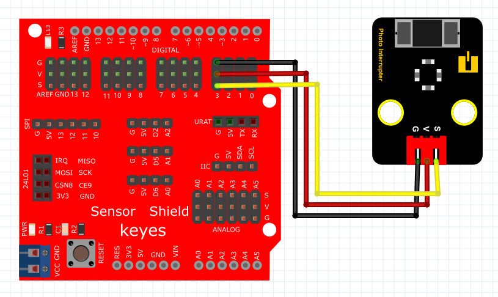

# Arduino


## 1. Arduino简介  

Arduino是一种开源的电子原型平台，专为将交互式电子项目变为现实而设计。它提供了简单易用的硬件和软件，适合初学者和专业开发者。Arduino平台由各种型号的开发板（如Arduino UNO、MEGA）构成，它们可以与多种传感器、模块及执行器兼容，用户可通过Arduino IDE进行编程，支持基于C/C++的编程语言。Arduino的特点包括：  

- **简单易用**：用户友好的界面和丰富的库，帮助新手快速入门。  
- **灵活性**：支持多种接口与外设，使其能用于多种应用场景。  
- **活跃社区**：大量教程、项目和示例代码，促进学习和创新。  

随着物联网和智能家居的兴起，Arduino被广泛应用于教育、原型设计、艺术作品和DIY项目中。  

## 2. 连接图  

  

## 3. 测试代码  

```cpp  
int Led = 13; // 定义数字口13  
int buttonpin = 3; // 定义数字口3  
int val; // 定义数字变量val  

void setup() {  
    pinMode(Led, OUTPUT); // 将Led设置为输出  
    pinMode(buttonpin, INPUT); // 将buttonpin设置为输入  
}  

void loop() {  
    val = digitalRead(buttonpin); // 读取到数字口3的数值，并赋值给 val  
    if (val == HIGH) { // 当val为高电平时，LED亮起  
        digitalWrite(Led, HIGH); // LED亮起  
    } else {  
        digitalWrite(Led, LOW); // LED变暗  
    }  
}  
```  

## 4. 测试结果  

按照上图接好线，烧录好代码，上电后，用纸片挡住模块凹槽后，LED模块灯亮起。  

## 5. 加强训练  

代码：  

```cpp  
int led = 13; // 定义LED引脚  
int inputPin = 3; // 定义输入引脚  
int x; // 定义变量x  

void setup() {  
    pinMode(led, OUTPUT); // 设置LED为输出  
    pinMode(inputPin, INPUT); // 设置inputPin为输入  
}  

void loop() {  
    int val = digitalRead(inputPin); // 读取inputPin的值  
    if (val == 1) { // 当val为1时  
        x++; // 增加x的值  
        digitalWrite(led, HIGH); // LED亮起  
        delay(500); // 延迟0.5秒  
    }  
    if (x == 2) { // 当x等于2时  
        digitalWrite(led, LOW); // LED熄灭  
        x = 0; // 重置x  
        delay(500); // 延迟0.5秒  
    }  
}  
```  

结果  

上传代码后，触发一次光折传感器时LED灯亮起，再触发一次时LED灯熄灭。实现这个功能的关键在于变量x，值得深入思考。


