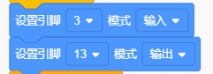
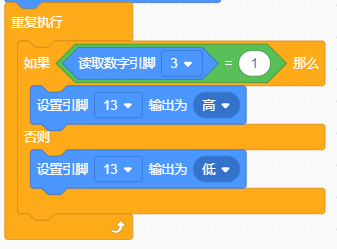
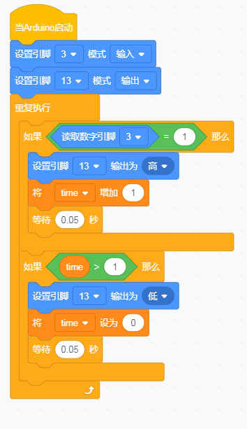

# KidsBlock

## 1. KidsBlock简介  

KidsBlock是一款面向初学者的图形化编程工具，旨在通过可视化界面帮助用户快速学习编程概念。它允许用户通过拖拽模块来构建程序，适合儿童和青少年。KidsBlock与Arduino等硬件平台兼容，使用户能够通过简单的图形化编程轻松实现对各种传感器和执行器的控制。该工具不仅提供多种学习项目和教程，还鼓励用户探索创造性电子项目，培养逻辑思维和问题解决能力。  

## 2. 连接图  

  

## 3. 测试代码  

1. 在事件栏拖出Arduino启动模块。  

     

2. 在引脚栏拖出两个设置引脚模式模块，一个设置为引脚3输入，另一个设置为引脚13输出。  

     

3. 在控制栏拖出重复执行模块。  

     

4. 在控制栏拖出判断模块，并在判断模块中添加运算的等于模块，等于模块的左边添加读取数字引脚3模块，右边设置为1；当满足条件时，第13引脚输出高电平，否则输出低电平。  

     

## 4. 测试结果  

按照上图接好线，烧录好代码，上电后，用纸片挡住模块凹槽后，D13灯亮起。  

## 5. 加强训练  

代码：

结果

上传代码后，触发一次时LED灯亮起，再触发一次时LED灯熄灭。实现这个功能的关键在于变量time，值得深入思考。

