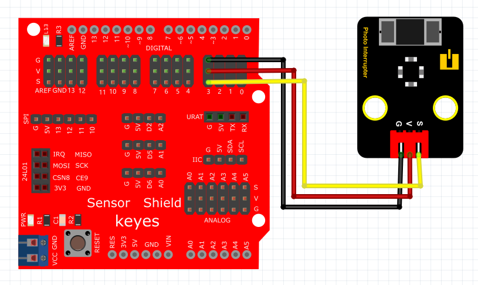
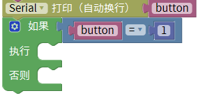
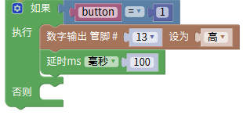
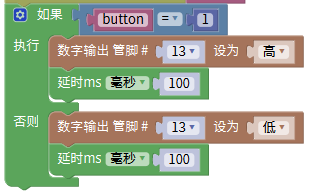
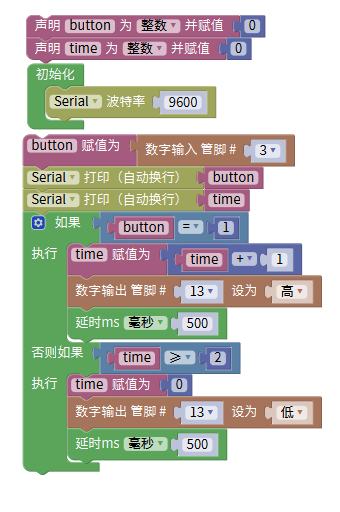

# Mixly

## 1. Mixly简介  

Mixly是一款基于Scratch的图形化编程工具，旨在使编程对初学者变得更简单和直观。它允许用户通过拖拽和组合模块来创建程序，特别适合儿童和青少年使用。Mixly支持多种硬件，例如Arduino，使得用户可以轻松连接传感器、执行器和其他组件，实现多种电子项目。该工具具有友好的用户界面和丰富的学习资源，帮助用户通过创建和调试项目来掌握编程和电子知识。  

## 2. 连接图  

  

## 3. 测试代码  

1. 在变量栏找到声明全局变量模块，将item变量名改为“button”，设置button初始变量为整数，赋值为0。  

     

2. 初始化设置波特率为9600，表示串口通信的速度。  

     

3. 在变量栏拖出button赋值模块，然后在输入/输出栏拖出数字引脚输入模块，设置引脚为3。  

     

4. 拖出串口栏下的打印并自动换行模块，将之前定义的变量button放在打印模块后面。  

     

5. 在控制栏拖出判断模块，并点击模块上的设置图案增加一个“否则”部分。  

     

6. 在逻辑栏拖出一个等于模块，将变量button与数字1进行比较。  

     

7. 在输入/输出栏拖出设置引脚模块，设置引脚为13为高电平，并拖出一个延时模块，延时为100ms。  

     

8. 再次拖出设置引脚模块，将引脚设为13为低电平，接着再拖出延时模块，延时为100ms。  

     

## 4. 测试结果  

按照上图接好线，烧录好代码，上电后，用纸片挡住模块凹槽后，LED模块灯亮起。  

## 5. 加强训练  

代码：

结果

上传代码后，触发一次时LED灯亮起，再触发一次时LED灯熄灭。实现这个功能的关键在于变量X，值得深入思考。

