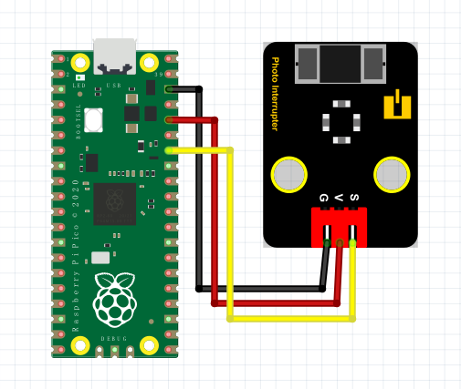

# Python


## 1. Python简介  

Python是一种广泛使用的高级编程语言，以其简单易读的语法和强大的功能而受到青睐。由Guido van Rossum于1991年首次发布，Python支持多种编程范式，包括面向对象、函数式和过程式编程。Python的设计理念强调代码的可读性，使得其成为初学者和专业开发者的理想选择。其丰富的标准库和活跃的开发社区使得用户能够轻松获取大量第三方库和模块，涉及数据科学、机器学习、网络开发、自动化等多个领域。  

Python适用于多种环境，包括Windows、macOS、Linux等，同时支持幅员广泛的应用，如网站开发、数据分析、人工智能和科学计算等。其简洁的语法使得编程过程顺畅，适合各种层次的开发者。  

## 2. 连接图  

  

## 3. 测试代码  

```python  
import machine  
import utime  

key = machine.Pin(28, machine.Pin.IN)  # 设置28脚为输入  
led = machine.Pin(25, machine.Pin.OUT)  # 设置25脚为输出  

while True:  
    if key.value() == 1:  # 判断输入是否为高电平  
        led.value(1)  # LED灯亮  
    else:  # 否则  
        led.value(0)  # LED灯灭  
```  

## 4. 测试结果  

按照上图接好线，烧录好代码，上电后，用纸片挡住模块凹槽后，LED模块灯亮起。  

## 5. 加强训练  

代码：  

```python  
import machine  
import utime  

key = machine.Pin(28, machine.Pin.IN)  
led = machine.Pin(25, machine.Pin.OUT)  
val = 0  

while True:  
    if key.value() == 1:  
        val += 1  
        led.value(1)  
        utime.sleep_ms(300)  

    if val == 2:  
        led.value(0)  
        val = 0  
        utime.sleep_ms(300)  
```  

结果

上传代码后，触发一次光折传感器时LED灯亮起，再触发一次时LED灯熄灭。实现这个功能的关键在于变量val，值得深入思考。

